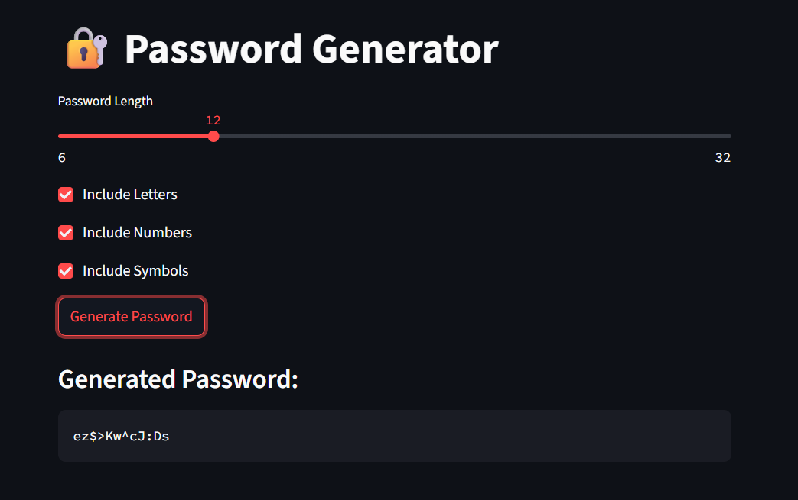

# 🔐 Password Generator App

A simple password generator app built with Streamlit.  
Generate strong passwords with customizable options for length, letters, numbers, and symbols.



## Table of Contents
- [About the Project](#about-the-project)
- [Features](#features)
- [Installation](#installation)
- [Usage](#usage)
- [Assumptions](#assumptions)
- [Deployment](#deployment)
- [License](#license)

## About the Project

This app allows users to generate secure, random passwords based on their preferences.  
Users can select the desired password length and choose whether to include letters, numbers, and symbols.  
The app is built using Python and Streamlit, providing a simple and interactive web interface.

## Features

- Adjustable password length (6-32 characters)
- Options to include/exclude letters, numbers, and symbols
- Real-time password generation
- User-friendly interface

## Installation

Open your terminal or command prompt and run the following commands:

1. **Clone the repository:** 
2. **Create a virtual environment:**
3. **Activate the virtual environment:**
- On **Windows**:
  ```
  .\env_password\Scripts\activate
  ```
- On **Mac/Linux**:
  ```
  source env_password/bin/activate
  ```

4. **Install dependencies:**
   ```
  pip install -r requirements.txt
  ```

6. **Run the app:**
   ```
  streamlit run password_generator.py
  ```

## Usage

- Set your desired password length using the slider.
- Choose to include letters, numbers, and/or symbols using the checkboxes.
- Click **"Generate Password"** to instantly create a password.
- Copy and use your secure password!

## Assumptions

- If no options are selected, the app defaults to using letters.
- Passwords are generated using Python’s built-in `random` and `string` modules.
- Intended for educational/demo purposes; for highly sensitive uses, consider using a cryptographically secure generator.

## Deployment

You can deploy this app for free using [Streamlit Community Cloud](https://streamlit.io/cloud):

1. **Push your code to a public GitHub repository.**
2. **Go to [Streamlit Cloud](https://streamlit.io/cloud) and sign in with your GitHub account.**
3. **Click "New app" and select your repository and branch.**
4. **Set `password_generator.py` as the main file.**
5. **Click "Deploy".**
6. **After a few moments, your app will be live at a public URL.**

**Live Demo:**  
[YOUR-DEPLOYED-APP-LINK-HERE]

## License

This project is open source and available under the [MIT License](LICENSE).

---

**Happy password generating!**


